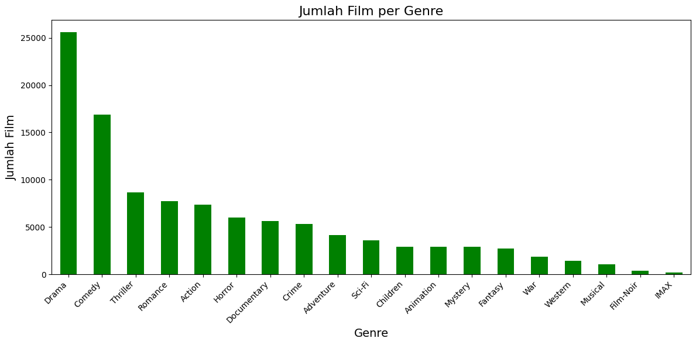
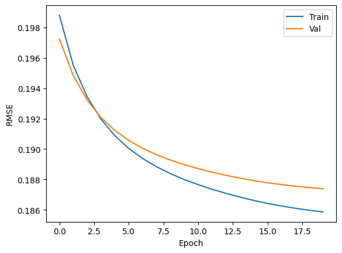

# Laporan Proyek Machine Learning - Berwyn Izzut Taghyir

## Overview Proyek
Seiring dengan kemajuan teknologi dan meningkatnya produksi konten digital, jumlah film yang dirilis setiap tahunnya juga meningkat pesat. Hal ini memberikan banyak pilihan kepada penikmat film, tetapi di sisi lain juga menimbulkan tantangan dalam menemukan film yang benar-benar sesuai dengan selera dan preferensi pribadi masing-masing individu. Sistem rekomendasi hadir sebagai solusi untuk membantu pengguna menyaring informasi dan menemukan konten yang relevan berdasarkan preferensi mereka.

Menurut studi yang dilakukan oleh Harper dan Konstan (2016) terkait dataset MovieLens, pemahaman mendalam mengenai sejarah dan konteks data rating pengguna sangat krusial dalam membangun sistem rekomendasi yang efektif. Mereka menekankan bahwa dataset seperti MovieLens, yang kaya akan interaksi pengguna, memungkinkan penerapan berbagai teknik, termasuk *collaborative filtering*, untuk menghasilkan rekomendasi yang dipersonalisasi. Proyek ini mengadopsi pendekatan tersebut dengan menerapkan *collaborative filtering* berbasis *deep learning* dan *content-based filtering* yang menggabungkan kemiripan konten (judul dan genre) dengan preferensi pengguna serta kemiripan genre murni.

**Pentingnya Proyek** 
Membangun sistem rekomendasi film tidak hanya bertujuan untuk meningkatkan pengalaman menonton pengguna, tetapi juga berdampak signifikan pada peningkatan *engagement* pengguna terhadap platform penyedia layanan film. Bagi industri perfilman, sistem ini dapat membantu mempromosikan film-film yang mungkin kurang populer namun relevan bagi segmen pengguna tertentu, sehingga meningkatkan diversitas konsumsi konten.

Proyek ini penting untuk diselesaikan karena:
-   Membantu pengguna mengatasi masalah *information overload* dalam memilih film.
-   Meningkatkan efisiensi pengguna dalam menemukan film yang sesuai dengan selera.
-   Memberikan pengalaman menonton yang lebih personal dan memuaskan.

Proyek ini dirancang dengan membangun dua jenis sistem rekomendasi berbasis machine learning, yaitu *collaborative filtering* menggunakan model *deep learning* dan *content-based filtering* yang diperkaya dengan heuristik berbasis preferensi pengguna dan kemiripan genre, dengan memanfaatkan dataset MovieLens yang diakses melalui Kaggle.

**Referensi:** 
Harper, F. M., & Konstan, J. A. (2016). The MovieLens Datasets: History and Context. *ACM Transactions on Interactive Intelligent Systems (TiiS)*, 5(4), 1-19. https://doi.org/10.1145/2827872

## Business Understanding
### **Problem Statements:**
1.  Pengguna seringkali kesulitan menemukan film baru yang sesuai dengan selera pribadi mereka di tengah banyaknya pilihan film yang tersedia, terutama jika mereka tidak memiliki banyak waktu untuk eksplorasi.
2.  Rekomendasi film yang bersifat generik atau tidak dipersonalisasi (misalnya, hanya berdasarkan popularitas umum) kurang efektif dalam memenuhi ekspektasi pengguna, sehingga mengurangi kepuasan dan pengalaman menonton.
3.  Pengguna yang telah memberikan rating pada film-film sebelumnya mengharapkan informasi tersebut dimanfaatkan untuk mendapatkan saran film lain yang relevan dengan preferensi mereka, namun seringkali platform belum memaksimalkannya secara optimal.

### **Goals:**
1.  Mengembangkan sistem rekomendasi film yang dapat membantu pengguna menemukan film baru yang sesuai dengan preferensi historis mereka secara efisien, sehingga meningkatkan kepuasan menonton.
2.  Mengembangkan sistem rekomendasi film yang dapat memberikan daftar rekomendasi film top-N yang secara spesifik disesuaikan dengan profil dan preferensi unik masing-masing pengguna menggunakan pendekatan *collaborative filtering* berbasis *deep learning*.
3.  Mengembangkan sistem rekomendasi *content-based* yang tidak hanya mengandalkan kemiripan konten (genre dan judul) tetapi juga memperhitungkan popularitas film di antara pengguna dengan selera serupa dan kemiripan genre murni untuk memberikan rekomendasi yang lebih relevan dan terdiversifikasi.

### **Solution Statements:**
Untuk mencapai tujuan tersebut, proyek ini akan menggunakan dua pendekatan solusi utama:

1.  **Collaborative Filtering (Deep Learning)**
    Pendekatan ini menggunakan model jaringan saraf untuk mempelajari representasi laten (embedding) dari pengguna dan film berdasarkan histori rating. Model *RecommenderNet* yang dibangun akan memprediksi rating yang mungkin diberikan pengguna terhadap film yang belum ditonton, dan merekomendasikan film dengan prediksi rating tertinggi.
2.  **Content-Based Filtering (dengan Heuristik Preferensi Pengguna dan Kemiripan Genre)**
    Pendekatan ini merekomendasikan film berdasarkan kemiripan konten (judul dan genre) menggunakan TF-IDF dan *cosine similarity*. Sistem ini diperkaya dengan heuristik yang menghitung skor gabungan (`score`) berdasarkan popularitas film di antara pengguna dengan selera serupa dan popularitas umum. Skor ini kemudian dikombinasikan dengan skor kemiripan genre murni (`sim_score`) antara film input dan film kandidat untuk menghasilkan `final_score` yang dinormalisasi.

## Data Understanding
### Dataset
Proyek ini menggunakan dataset MovieLens yang tersedia di Kaggle ([Movie Recommendation System Dataset](https://www.kaggle.com/datasets/parasharmanas/movie-recommendation-system/data)). Dataset ini populer untuk penelitian sistem rekomendasi karena berisi informasi rating film oleh pengguna serta metadata film.

Dataset ini bertujuan untuk memungkinkan pembangunan sistem yang memahami preferensi pengguna berdasarkan histori rating mereka terhadap film. Target dari dataset ini adalah untuk menghasilkan rekomendasi film yang relevan. Dataset ini terdiri dari 2 file utama: `movies.csv` dan `ratings.csv`.

**Deskripsi Variabel**
**Dataset `movies.csv`** 
Total data: 62.423 data (setelah pembersihan `(no genres listed)` menjadi 57.361 data) 
Berikut adalah daftar fitur (variabel) yang terdapat dalam dataset:
-   `movieId`: Nomor unik identifikasi film (Integer)
-   `title`: Judul Film, seringkali menyertakan tahun rilis (String)
-   `genres`: Genre film, dipisahkan oleh `|` (String)
-   `clean_title`: Judul film yang sudah dibersihkan (String, dibuat saat preprocessing)
-   `genres_list`: Genre film yang sudah dibersihkan (String, spasi sebagai pemisah, dibuat saat preprocessing)

**Dataset `ratings.csv`** 
Total data: 25.000.095 data 
Berikut adalah daftar fitur (variabel) yang terdapat dalam dataset:
-   `userId`: ID unik pengguna (Integer)
-   `movieId`: Nomor unik identifikasi film (Integer)
-   `rating`: Rating film dari pengguna (Float, skala 0.5-5)
-   `timestamp`: Waktu pemberian rating (Integer, dihapus saat preprocessing)

### Tahapan Awal Eksplorasi Data 
Beberapa tahapan eksplorasi dan pemahaman data yang dilakukan:
#### 1. Load Dataset 
Dataset `movies.csv` dan `ratings.csv` dimuat ke dataframe pandas.
#### 2. Melihat Struktur Dataset 
Menggunakan fungsi `info()` pada kedua dataframe. 
**Insight:**
-   Dataset `movies` memiliki 3 kolom (`movieId`, `title`, `genres`) dengan tipe data `int64` dan `object`. Memori yang digunakan sekitar 1.4+ MB.
-   Dataset `ratings` memiliki 4 kolom (`userId`, `movieId`, `rating`, `timestamp`) dengan tipe data `int64` dan `float64`. Memori yang digunakan sekitar 762.9 MB.
#### 3. Cek Missing Values dan Duplikat 
Dilakukan dengan fungsi `isna().sum()` dan `duplicated().sum()`. 
**Insight:**
-   Tidak ada nilai null pada dataset `movies` dan `ratings` pada kolom-kolom utama.
-   Tidak ada data duplikat pada kedua dataset.
-   Terdapat 5062 film dengan `(no genres listed)` pada kolom `genres`.
#### 4. Univariate Exploratory Data Analysis
1.  Jumlah Film, Judul, Genre Unik 
    **Insight:**
    -   Jumlah Film Unik: 62.423
    -   Jumlah Judul Film Unik: 62.325
    -   Jumlah Kombinasi Genre Unik: 1.639
2.  Jumlah UserID Unik, Film yang Diulas, Total Rating 
    **Insight:**
    -   Jumlah UserID Unik: 162.541
    -   Jumlah Film yang Diulas: 59.047
    -   Jumlah Data Rating: 25.000.095
3.  Top Genres 
    Menampilkan distribusi jumlah film per genre. 
      
    **Insight:**
    -   Genre Drama, Comedy, dan Thriller merupakan genre yang paling banyak muncul dalam dataset. Action dan Romance juga cukup dominan.
4.  Top 10 Film dengan Rata-Rata Rating Tertinggi 
    Setelah menggabungkan `movies` dan `ratings`, dihitung rata-rata rating per film. 
    **Insight:**
    -   Banyak film dengan rata-rata rating 5.0, namun ini bisa jadi karena jumlah pemberi ratingnya sedikit. Contohnya "'Master Harold' ... And the Boys (2010)".

## Data Preparation
Tahapan ini mencakup langkah-langkah untuk mempersiapkan data sebelum digunakan dalam proses modeling agar data dalam kondisi bersih, konsisten, dan sesuai untuk masing-masing algoritma.
1.  **Pembersihan Kolom `genres` pada `df_movies`**:
    -   Mengganti karakter `|` dengan spasi.
    -   Menghapus baris film dengan `genres` berisi `(no genres listed)`.
    -   Membuat kolom baru `genres_list` yang identik dengan kolom `genres` yang sudah dibersihkan.
    *Alasan:* Memastikan format genre konsisten dan menghilangkan data yang tidak informatif untuk content-based filtering.

2.  **Pembersihan Kolom `title` pada `df_movies`**:
    -   Membuat fungsi `clean_title` untuk mengubah judul menjadi huruf kecil, menghapus tahun dalam tanda kurung, menghapus karakter spesial, dan menghilangkan spasi berlebih.
    -   Menerapkan fungsi ini untuk membuat kolom baru `clean_title`.
    *Alasan:* Normalisasi judul film untuk meningkatkan akurasi pencarian dan perhitungan kemiripan berbasis judul.

3.  **Menghapus Kolom `timestamp` dari `df_ratings`**:
    *Alasan:* Kolom ini tidak digunakan dalam model.

4.  **Menggabungkan Dataset**:
    -   Menggabungkan `df_ratings` dan `df_movies` berdasarkan `movieId`.
    *Alasan:* Untuk mendapatkan informasi film dan rating dalam satu dataframe.

5.  **Persiapan Data untuk Collaborative Filtering (Deep Learning)**:
    -   **Encoding User dan Movie ID**: Mengubah `userId` dan `movieId` menjadi integer berurutan.
    -   **Normalisasi Rating**: Mengubah skala rating menjadi [0, 1].
    -   **Pembagian Data**: Membagi data menjadi data latih (80%) dan data validasi (20%).
    *Alasan:* Mempersiapkan data untuk input model deep learning dan evaluasinya.

6.  **Persiapan Data untuk Content-Based Filtering**:
    -   **TF-IDF Vectorization**: Menerapkan `TfidfVectorizer` pada kolom `clean_title` dan `genres_list` dari `df_movies` dengan `ngram_range=(1,2)`.
    *Alasan:* Mengubah data teks menjadi representasi vektor numerik untuk perhitungan *cosine similarity*.

## Modeling and Results

### **1. Collaborative Filtering (Deep Learning)**
Pendekatan ini menggunakan model jaringan saraf `RecommenderNet` untuk mempelajari pola dari interaksi pengguna-film dan menghasilkan rekomendasi.

 Model terdiri dari lapisan Embedding untuk pengguna dan film, lapisan bias, dan fungsi aktivasi sigmoid untuk prediksi rating ternormalisasi.

**Kelebihan:**
-   Mampu menangkap pola kompleks.
-   Potensial menghasilkan rekomendasi personal yang akurat.

**Kekurangan:**
-   Masalah *cold-start*.
-   Membutuhkan data interaksi yang cukup.

**Untuk Training model**:
-   Optimizer `Adam` (learning rate 1e-4), loss `binary_crossentropy`, metrik `RootMeanSquaredError`.
-   Dilatih selama 20 epoch dengan callbacks (ReduceLROnPlateau, EarlyStopping, ModelCheckpoint).

**Hasil Rekomendasi** (Contoh untuk User ID 8868): 
| No | Title                                  | Genres                   |
|----|----------------------------------------|--------------------------|
| 1  | Harakiri (Seppuku) (1962)             | Drama                    |
| 2  | The Blue Planet (2001)                | Documentary              |
| 3  | Planet Earth (2006)                   | Documentary              |
| 4  | Life (2009)                           | Documentary              |
| 5  | Over the Garden Wall (2013)           | Adventure, Animation, Drama |
| ... | ...                                    | ...                      |

### **2. Content-Based Filtering (dengan Heuristik Preferensi Pengguna dan Kemiripan Genre)**
Pendekatan ini merekomendasikan film berdasarkan kemiripan konten (judul dan genre) yang diperkaya dengan informasi preferensi pengguna lain dan kemiripan genre murni.

 Konten yang dianalisis adalah `clean_title` dan `genres_list` menggunakan TF-IDF dan *cosine similarity*. Fungsi `scores_calculator` menghitung:
1.  **Skor Preferensi Pengguna Serupa (`similar_user_recs`)**: Normalisasi dari jumlah pengguna (yang menyukai film input) yang juga menyukai film kandidat.
2.  **Skor Preferensi Umum (`all_users_recs`)**: Normalisasi dari jumlah semua pengguna (yang menyukai film-film yang disukai oleh pengguna serupa) yang juga menyukai film kandidat.
3.  **Skor Gabungan Awal (`score`)**: Kombinasi berbobot (0.6 untuk `similar_user_recs` dan 0.4 untuk `all_users_recs`), dengan penyesuaian bobot jika genre film kandidat mirip dengan film input (bobot 1.5 untuk `similar_user_recs` dan 0.9 untuk `all_users_recs`).
4.  **Skor Kemiripan Genre Murni (`sim_score`)**: *Cosine similarity* antara vektor TF-IDF genre film input dan film kandidat.
5.  **Skor Akhir (`final_score`)**: Kombinasi berbobot (0.7 untuk `score` dan 0.3 untuk `sim_score`), kemudian dinormalisasi ke rentang [0,1] menggunakan `MinMaxScaler`.

**Kelebihan:**
-   Mempertimbangkan kemiripan konten dan popularitas kontekstual.
-   Transparan, dengan skor kemiripan genre yang eksplisit.
-   Lebih tahan terhadap *over-specialization*.

**Kekurangan:**
-   Kualitas bergantung pada metadata dan efektivitas heuristik.
-   Perhitungan skor bisa kompleks dan bobot perlu di-tuning.

Langkahnya: pengguna memasukkan judul -> `search_by_title` mencari kandidat -> pengguna memilih -> `scores_calculator` menghitung skor -> `recommendation_results` menampilkan top-N.

Contoh: Jika pengguna mencari "Toy Story" dan memilih "Toy Story 2 (1999)":

**Hasil Rekomendasi:** 
| No | Recommended Movie                        | Genres                                       | score    | sim_score | final_score |
|----|--------------------------------------------|----------------------------------------------|----------|-----------|-------------|
| 1  | Toy Story 2 (1999)                        | Adventure, Animation, Children, Comedy, Fantasy | 0.983611 | 1.000000  | 1.000000    |
| 2  | Toy Story (1995)                          | Adventure, Animation, Children, Comedy, Fantasy | 0.874127 | 1.000000  | 0.922469    |
| 3  | Monsters, Inc. (2001)                     | Adventure, Animation, Children, Comedy, Fantasy | 0.409754 | 1.000000  | 0.593626    |
| 4  | Shrek (2001)                              | Adventure, Animation, Children, Comedy, Fantasy, Romance | 0.420460 | 0.886559  | 0.566780    |
| 5  | Finding Nemo (2003)                       | Adventure, Animation, Children, Comedy       | 0.376863 | 0.858481  | 0.527384    |
| 6  | Shawshank Redemption, The (1994)          | Crime, Drama                                 | 0.741638 | 0.000000  | 0.525157    |
| 7  | Matrix, The (1999)                        | Action, Sci-Fi, Thriller                     | 0.677699 | 0.000000  | 0.479879    |
| 8  | Star Wars: Episode IV - A New Hope (1977) | Action, Adventure, Sci-Fi                    | 0.638385 | 0.087919  | 0.478722    |
| 9  | Incredibles, The (2004)                   | Action, Adventure, Animation, Children, Comedy | 0.337925 | 0.773725  | 0.474088    |
| 10 | Pulp Fiction (1994)                       | Comedy, Crime, Drama, Thriller               | 0.646498 | 0.039931  | 0.469903    |

## Evaluation
### **1. Collaborative Filtering (Deep Learning)**
**Metrik Evaluasi yang Digunakan**
 Root Mean Squared Error (RMSE) digunakan sebagai metrik utama untuk mengevaluasi seberapa akurat model memprediksi rating pengguna.
**Cara Kerja Metrik RMSE:**
 RMSE menghitung akar kuadrat dari rata-rata kuadrat selisih antara nilai rating aktual ($y_i$) dan nilai rating prediksi ($\hat{y}_i$). Langkah-langkahnya:
1.  Untuk setiap interaksi pengguna-film di set validasi, hitung selisih antara rating aktual dan rating prediksi: $(y_i - \hat{y}_i)$.
2.  Kuadratkan selisih tersebut: $(y_i - \hat{y}_i)^2$. Ini memberi penalti lebih besar pada kesalahan yang besar.
3.  Hitung rata-rata dari semua kuadrat selisih tersebut (Mean Squared Error - MSE).
4.  Ambil akar kuadrat dari MSE untuk mendapatkan RMSE.
Nilai RMSE memiliki satuan yang sama dengan rating (dalam kasus ini, rating yang dinormalisasi), sehingga mudah diinterpretasikan. Semakin kecil nilai RMSE, semakin dekat prediksi model dengan nilai aktual, yang berarti model lebih akurat.

**Kenapa Menggunakan RMSE?**
 RMSE dipilih karena memberikan gambaran yang jelas tentang seberapa jauh hasil prediksi model dari nilai sebenarnya. Meskipun loss function yang digunakan adalah `binary_crossentropy` (karena output sigmoid), RMSE tetap relevan untuk menginterpretasikan error dalam konteks prediksi rating.

 **Rumus:** 

$$\text{RMSE} = \sqrt{\frac{1}{n}\sum_{i=1}^{n}(y_i - \hat{y}_i)^2}$$

 
Hasil RMSE Model: 
  
**Insight:**
-   Pada akhir epoch ke-20, model memperoleh nilai `root_mean_squared_error`: **0.1857** untuk data latih dan **0.1874** untuk data validasi.
-   Perbedaan antara RMSE latih dan validasi yang kecil menunjukkan model tidak mengalami overfitting yang parah dan memiliki generalisasi yang baik. Penurunan RMSE yang stabil mengindikasikan pembelajaran yang efektif.

### 2. Content-Based Filtering (dengan Heuristik Preferensi Pengguna dan Kemiripan Genre)

**Metrik Evaluasi yang Digunakan**  
Evaluasi pendekatan ini lebih difokuskan pada analisis kualitatif dari output, dengan memperhatikan kolom **`Genre Similarity to Input`** (skor kemiripan genre murni) dan **`final_score`** (skor gabungan yang dinormalisasi).

**Cara Kerja Interpretasi `Genre Similarity to Input` (`sim_score`):**  
Skor ini dihitung menggunakan *cosine similarity* antara vektor TF-IDF genre film input (dipilih pengguna) dan vektor TF-IDF genre setiap film kandidat.

1. Genre film input dan kandidat diubah menjadi vektor numerik TF-IDF yang menangkap pentingnya kata/frasa genre.  
2. *Cosine similarity* mengukur kemiripan arah antara dua vektor:  
   
   $$\text{cosine similarity}(\mathbf{A}, \mathbf{B}) = \frac{\mathbf{A} \cdot \mathbf{B}}{\|\mathbf{A}\| \|\mathbf{B}\|}$$
   
   - Nilai mendekati 1 → genre sangat mirip  
   - Nilai mendekati 0 → genre sangat berbeda atau ortogonal  

Dengan melihat **`Genre Similarity to Input`**, kita dapat menilai kontribusi kemiripan genre murni pada rekomendasi. Sedangkan **`final_score`** menggabungkan ini dengan sinyal preferensi pengguna (popularitas, rating, dan heuristik).

---

**Kenapa Fokus pada `Genre Similarity to Input` untuk Analisis Konten?**  
Skor ini merefleksikan inti Content-Based Filtering, yaitu merekomendasikan item berdasarkan kesamaan fiturnya. Dalam sistem hybrid, skor ini membantu menilai apakah rekomendasi didasari oleh kesamaan konten atau lebih dipengaruhi sinyal popularitas dari skor awal.

---

**Evaluasi Kualitatif (dan Potensi Kuantitatif):**  
Analisis kualitatif melihat apakah film dengan **`final_score`** tinggi juga memiliki **`Genre Similarity to Input`** yang logis atau ada diversifikasi genre.

Untuk evaluasi kuantitatif, metrik seperti **Precision@K** dan **Recall@K** dapat digunakan. Prosedur umum:

- **Definisi relevansi:** Sebuah film dianggap relevan jika berada dalam *hold-out set* pengguna dan memenuhi threshold skor kemiripan genre (misal, `sim_score > 0.5`) atau `final_score` tinggi.

- **Precision@K** menghitung proporsi rekomendasi relevan di antara K teratas:

$$\text{Precision@K} = \frac{|\{\text{Rekomendasi relevan di top K}\}|}{K}$$

- **Recall@K** mengukur proporsi film relevan dari *hold-out set* yang berhasil direkomendasikan di top K:

$$\text{Recall@K} = \frac{|\{\text{Rekomendasi relevan di top K}\}|}{|\{\text{Total item relevan dalam hold-out set}\}|}$$

---

**Contoh Hasil (Kualitatif dari Output Notebook):**  
Untuk input **"Toy Story 2 (1999)"**:

- Film input sendiri memiliki **`final_score` = 1.0** dan **`Genre Similarity to Input` = 1.0** (identik).  
- Film seperti **"Toy Story (1995)"** dan **"Monsters, Inc. (2001)"** juga memiliki skor genre 1.0, menunjukkan kemiripan tinggi, dan `final_score` tinggi (0.92 dan 0.59).  
- Film seperti **"Shawshank Redemption"** memiliki skor genre 0.0 (genre berbeda) namun `final_score` cukup tinggi (0.52), menandakan rekomendasi berdasar popularitas atau preferensi pengguna yang kuat.  
- Rekomendasi lain seperti **"Star Wars: Episode IV"** memiliki skor genre rendah (0.087) dan `final_score` moderat (0.478), memperlihatkan keseimbangan antara kemiripan konten dan preferensi komunitas.

---

**Insight (Kualitatif):**  
- Sistem merekomendasikan film dengan kemiripan genre tinggi secara efektif.  
- Sistem juga mampu merekomendasikan film berbeda genre jika didukung preferensi pengguna (potensi *serendipity*).  
- Kolom **`final_score`** dan **`Genre Similarity to Input`** bersama-sama memberikan pemahaman mengapa sebuah film direkomendasikan, menggabungkan konten dan sinyal sosial.
  
## Conclusion

-   Model Collaborative Filtering berbasis Deep Learning mencapai RMSE **0.1857** (latih) dan **0.1874** (validasi), menunjukkan performa prediksi rating yang baik.
-   Model Content-Based Filtering yang diperbarui berhasil menggabungkan kemiripan konten (judul dan genre) dengan preferensi pengguna dan kemiripan genre murni, menghasilkan skor akhir yang lebih terdiferensiasi. Hasil kualitatif menunjukkan sistem mampu merekomendasikan film yang mirip secara genre maupun yang populer di antara pengguna dengan selera serupa.
-   Kedua pendekatan menawarkan solusi yang valid, dengan CF berfokus pada pola interaksi dan CBF pada karakteristik film yang diperkaya dengan sinyal komunitas dan konten.

---
